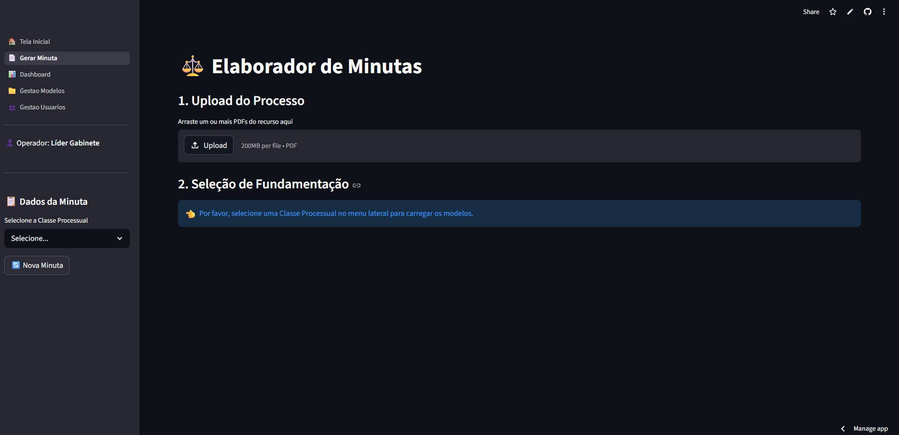

<div align="center">
  
# ⚖️ Sistema Gerador de Minutas Judiciais com IA




</div>

<br>

## 📖 Sobre o Projeto
Uma aplicação web desenvolvida para automatizar e otimizar a rotina de gabinetes jurídicos. O sistema utiliza a API do Google Gemini (Visão e Texto) para analisar múltiplos autos processuais (inclusive PDFs escaneados) e redigir minutas de relatórios padronizados, baseando-se estritamente na base de conhecimento e nos modelos de fundamentação definidos pelos magistrados.

## ✨ Principais Funcionalidades
* **Autenticação e Autorização:** Sistema de login com controle de perfis de acesso (Gerente/Funcionário) e proteção de rotas.
* **Leitura Multimodal Avançada:** Capacidade de processar e cruzar dados de múltiplos arquivos PDF simultaneamente, utilizando OCR nativo da IA para ler documentos escaneados.
* **Central de Modelos de Fundamentação (CRUD):** Gestão de peças jurídicas padronizadas com extração automatizada de texto a partir de arquivos `.pdf` e `.docx`.
* **Editor e Versionamento:** Interface para revisão humana da peça gerada pela IA, com salvamento do histórico de edições no banco de dados.
* **Exportação Multiformato:** Geração do documento final formatado com suporte a caracteres jurídicos complexos (UTF-8) para download em `.TXT`, `.PDF` e `.DOCX` (Word).
* **Conformidade LGPD:** Rotina automatizada de "faxina digital" que deleta os arquivos temporários do servidor local e da nuvem da IA imediatamente após o processamento.

## 🛠️ Tecnologias Utilizadas
* **Frontend/Backend:** Python, Streamlit
* **Banco de Dados & Autenticação:** Supabase (PostgreSQL), REST API
* **Inteligência Artificial:** Google Generative AI (Gemini 1.5 Flash - File API)
* **Segurança:** Bcrypt (Hashing de senhas com Salt), `python-dotenv`
* **Manipulação de Arquivos:** `PyMuPDF` (fitz), `fpdf2`, `python-docx`

## ⚙️ Arquitetura e Segurança
Este projeto foi desenhado com foco na proteção de dados sensíveis:
1. **Senhas Criptografadas:** Utilização do algoritmo Bcrypt para armazenamento seguro.
2. **Data Transfer Objects (DTO):** Consultas ao banco de dados filtradas para transitar apenas os dados estritamente necessários no front-end.
3. **Isolamento de Fatos vs. Direito:** Engenharia de prompt rigorosa que impede a IA de "alucinar" leis externas, forçando-a a usar apenas os modelos previamente cadastrados pelo gabinete.

## 🚀 Como Executar o Projeto Localmente

### Pré-requisitos
* Python 3.10 ou superior
* Conta no Supabase (com tabelas de `usuarios`, `modelos_fundamentacao` e `historico_minutas`)
* Chave de API do Google Gemini

### Passos de Instalação

1. Clone este repositório:
```bash
git clone https://github.com/Frederico-Dellu/Sistema-minutas-ia.git
cd Sistemas-minutas-ia
```
2. Crie e ative um ambiente virtual:
```bash
python -m venv venv
# No Windows:
venv\Scripts\activate
# No Linux/Mac:
source venv/bin/activate
```
3. Instale as dependências:
```bash
pip install -r requirements.txt
```
4. Configure as variáveis de ambiente:
Crie um arquivo .env na raiz do projeto e adicione suas credenciais:
```bash
SUPABASE_URL="sua_url_aqui"
SUPABASE_KEY="sua_chave_aqui"
GEMINI_KEY="sua_chave_gemini_aqui"
```
5. Inicie a aplicação:
````bash
streamlit run 🏠_Tela_Inicial.py
````

👨‍💻 Autor<br>
Frederico Dellú
[LinkedIn](https://www.linkedin.com/in/frederico-dellu/?lipi=urn%3Ali%3Apage%3Ad_flagship3_feed%3BxlaHiNueTEalK9bieL5KwQ%3D%3D)
